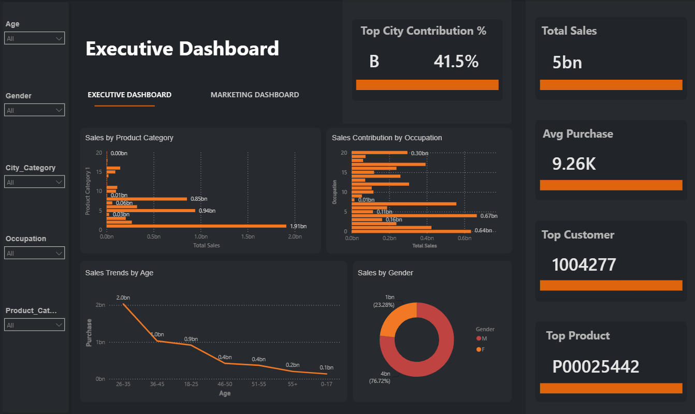
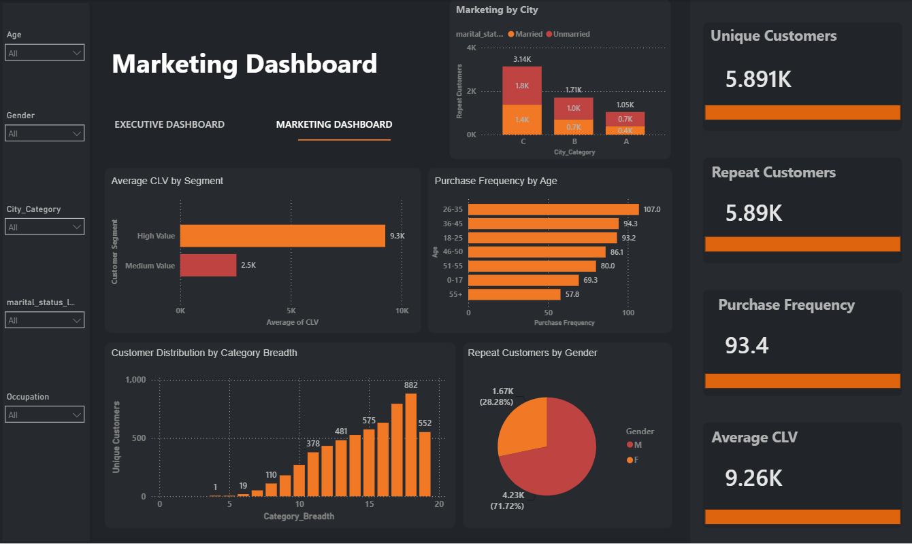

# 🏠 Black Friday Sales Analysis

An end-to-end data analytics project analyzing Black Friday retail sales using SQL, Python, and Power BI.

## 📊 Project Overview

This project analyzes customer purchasing behavior, sales performance, product categories, occupations, demographics, customer lifetime value, purchase frequency, and repeat customer behavior.

The project follows an end-to-end analytics workflow:
- Data validation
- Data cleaning
- SQL analysis
- Python exploratory data analysis
- Feature engineering
- Statistical analysis
- Power BI dashboard development
- Business insights
- Strategic recommendations

## 🎯 Business Objectives

The main business objectives of this project are to:

1. **Analyze overall sales performance**  
   Evaluate total sales and average purchase values to understand overall retail performance.

2. **Identify high-performing product categories**  
   Analyze product-category sales to identify categories that contribute significantly to overall revenue.

3. **Understand customer purchasing behavior**  
   Examine customer demographics, purchase frequency, repeat purchases, and category breadth to understand purchasing patterns.

4. **Identify valuable customer segments**  
   Use Customer Lifetime Value (CLV) and customer segmentation to identify high-value customer groups.

5. **Analyze occupation and demographic patterns**  
   Evaluate purchasing behavior across occupations, age groups, gender, marital status, and city categories.

6. **Evaluate regional sales performance**  
   Analyze city-level purchasing patterns and customer distribution to understand differences across city categories.

7. **Support customer retention strategies**  
   Analyze repeat customers and purchase frequency to identify opportunities for improving customer retention and engagement.

8. **Generate data-driven business recommendations**  
   Translate analytical findings into actionable recommendations for marketing, customer retention, regional strategy, and cross-selling opportunities.
   
## Dataset

The dataset contains 550,068 transaction records covering customer demographics, product categories, occupation, city category, and purchase amount.

### Main Columns

- User_ID
- Product_ID
- Gender
- Age
- Occupation
- City_Category
- Stay_In_Current_City_Years
- Marital_Status
- Product_Category_1
- Product_Category_2
- Product_Category_3
- Purchase

## 🛠️ Tools & Technologies

- MySQL
- Python
- Pandas
- NumPy
- Matplotlib
- Seaborn
- SciPy
- Statsmodels
- SQLAlchemy
- PyMySQL
- Power BI

## Project Workflow

### 1. Data Validation

The dataset was loaded and validated using SQL and Python.

Validation included:

- Record count verification
- Schema validation
- Duplicate checking
- Missing-value analysis
- Data type checking

The Python and SQL record counts were validated against 550,068 records.

### 2. Data Cleaning & Feature Engineering

The analysis includes data cleaning and creation of additional analytical features.
Key derived features include:
- Customer Lifetime Value (CLV)
- Category Breadth
- Stay Years
- City Loyalty Index
- Marital Status Label
- City Tenure Number

### 3. Exploratory Data Analysis

Python was used to analyze:
- Purchase distribution
- Sales by gender
- Sales by age group
- Sales by occupation
- Sales by product category
- Sales by marital status
- Average purchase by age and gender
- Customer purchasing behavior
- City-level purchasing patterns
- Product-category performance

### 4. Statistical Analysis

Statistical analysis included:
- Independent t-tests
- One-way ANOVA
- Pearson correlation
- P-value interpretation
- Confidence interval analysis
These methods were used to examine differences and relationships in purchasing behavior across customer and demographic groups.

# Power BI Dashboard

The final interactive dashboards were developed using Microsoft Power BI.

## Executive Dashboard

The Executive Dashboard provides an overview of sales performance.

### Key KPIs

- Total Sales
- Average Purchase
- Top Customer
- Top Product
- Top City Contribution %

### Visualizations

- Sales by Product Category
- Sales Contribution by Occupation
- Sales Trends by Age
- Sales by Gender



## Marketing Dashboard

The Marketing Dashboard focuses on customer behavior, retention, and customer value.

### Key KPIs

- Unique Customers
- Repeat Customers
- Purchase Frequency
- Average CLV

### Visualizations

- Average CLV by Segment
- Purchase Frequency by Age
- Customer Distribution by Category Breadth
- Repeat Customers by Gender
- Marketing by City



## 📈 Key Analytical Areas

The project examines:
- Sales performance
- Customer segmentation
- Customer lifetime value
- Repeat customer behavior
- Purchase frequency
- Product-category performance
- Occupation-wise sales
- Age-wise purchasing behavior
- Gender-wise purchasing behavior
- City-level purchasing patterns
- Customer category breadth

## 💼 Business Recommendations

Based on the analysis, potential business actions include:
1. Develop targeted marketing campaigns based on customer purchasing behavior.

2. Use Customer Lifetime Value and purchase frequency to identify valuable customer segments.

3. Use city-level purchasing patterns to support regional marketing strategies.

4. Use product-category behavior to identify cross-selling opportunities.

5. Monitor demographic and occupation segments to understand differences in purchasing behavior.

## Project Structure

```text
black-friday-sales-analysis/
│
├── README.md
│
├── Data/
|     └── black_friday_sales_analysis_cleaned_main_data.xlsx
|     └── cleaning_decisions.xlsx
|     └── data_quality_summary.xlsx
|     └── validation_results.xlsx
│
├── SQL/
│   └── black_friday_database_and_table_creation.sql
|   └── black_friday_data_insertion.sql
|   └── black_friday_sales_sql_queries.sql
|   └── Black_Friday_Database_Model(ER Diagram).sql
│
├── Python/
│   └── black_friday_sales_analysis.py
│
├── Power_BI/
│   ├── black_friday_sales_analysis.pbix
│   ├── executive_dashboard.png
│   └── marketing_dashboard.png
│
└── Reports/
    └── Black_Friday_Sales_Marketing_Analysis_Executive_Summary_Report.pdf
    └── Black_Friday_Sales_Analysis_presentation_report.pptx
```

## How to Use

### SQL

Open the SQL script in MySQL Workbench and execute the queries against the project database.

### Python

Install the required Python libraries:

```text
pandas
numpy
matplotlib
seaborn
scipy
statsmodels
sqlalchemy
pymysql
```
Then run the Python analysis script.

### Power BI

Open:

```text
Power_BI/black_friday_sales_analysis.pbix
```

using Power BI Desktop.

## Skills Demonstrated

- Data Cleaning
- Data Validation
- SQL
- Python
- Exploratory Data Analysis
- Statistical Analysis
- Customer Analytics
- KPI Development
- Data Visualization
- Power BI
- Dashboard Development
- Business Intelligence
- Business Recommendations

## 👤 Author

**Gourav Mallick**
Aspiring Data Analyst | Tableau | SQL | Python | Data Visualization

📍 Location: [Kolkata]

LinkedIn: [[LinkedIn profile link here](https://www.linkedin.com/in/gourav-mallick-6824b4422/)]

## 🔗 Project Links

💼 **LinkedIn Project Post:** [LinkedIn Post Link]
---
## 📬 Connect With Me

I’m currently building my portfolio in **Data Analytics, Business Intelligence, SQL, Python, and Tableau**.
If you’re interested in data analytics, visualization, or business intelligence, feel free to connect with me on LinkedIn.

---
⭐ If you found this project useful, feel free to star the repository!
